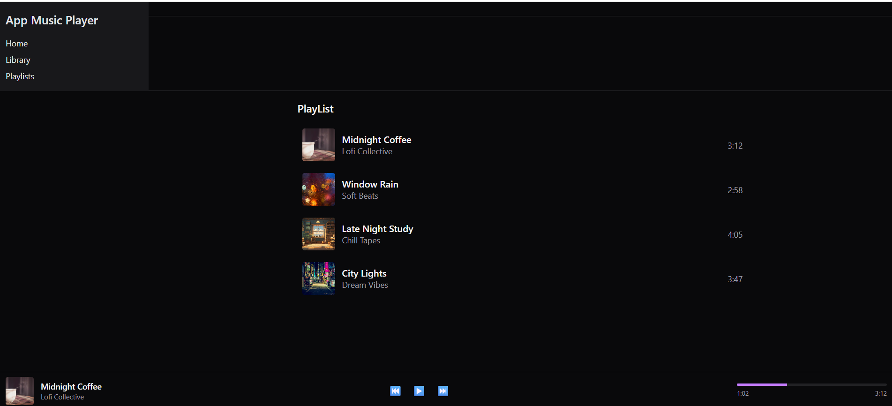

# 🎵 App Music React - Lofi Player

Creación de app de música para tarea final módulo 3 diplomado fullstack
Este proyecto es una aplicación web desarrollada con **React** y **Vite**, estilizada con **Tailwind CSS**, que presenta una interfaz minimalista para reproducir música **lofi**. Solamente es la interfaz gráfica ya que la tarea final para el Diplomado de FullStack módulo 3 de Front End.

## 🚀 Funcionalidades

- 🎧 Reproductor de música lofi
- 🎨 Interfaz moderna y responsiva
- 🌙 Temática oscura (dark mode por defecto)
- ⚛️ Componentización con React
- ⚡️ Deploy automático en **Vercel**

## 🖼️ Vista previa

 <!-- Asegúrate de tener esta imagen o cambiar el path -->

## 🛠️ Tecnologías utilizadas

- [React](https://reactjs.org/)
- [Vite](https://vitejs.dev/)
- [Tailwind CSS](https://tailwindcss.com/)
- [Vercel](https://vercel.com/)

## 📁 Estructura del proyecto

```bash
AppMusicReact/
```
src/
├── assets/                # Archivos multimedia como imágenes, íconos, etc.
├── components/            # Componentes reutilizables
│   ├── AppShell/          # Estructura base de la app (Header, Sidebar)
│   │   ├── Header.jsx
│   │   └── Sidebar.jsx
│   ├── Player/            # Barra de reproducción
│   │   └── PlayerBar.jsx
│   └── Track/             # Elementos de las pistas
│       ├── TrackCard.jsx
│       └── TrackList.jsx
├── data/ 
    └── TrackList.jsx       # Archivo de datos de canciones
├── App.jsx
├── main.jsx
├── App.css
├── index.css
```.config.js
```

## ▶️ Cómo ejecutar el proyecto localmente

1. Clona el repositorio:

   ```bash
   git clone https://github.com/jose260390/AppMusicReact.git
   cd AppMusicReact
   ```

2. Instala las dependencias:

   ```bash
   npm install
   ```

3. Inicia el entorno de desarrollo:

   ```bash
   npm run dev
   ```

4. Abre tu navegador en [http://localhost:5173](http://localhost:5173)

## ☁️ Deploy

El proyecto está desplegado en **Vercel**:  
🔗 [https://app-music-react-lyb8.vercel.app/](https://app-music-react-lyb8.vercel.app/)

## 🧑‍💻 Autor

- **José Bravo Honores**  
  Desarrollador Fullstack - Diplomado 2024  
  [GitHub](https://github.com/jose260390)